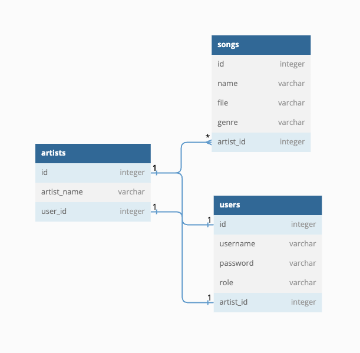

# Music Library API

## Introduction
A client wants you to develop a basic music library API, where a user can upload a song, list available songs etc... He also wants an admin API to manage users etc...
Your goal is to implement a Spring Boot application exposing the list of endpoints bellow. The API exposes public and secured endpoints. The secured endpoints should be protected using spring security with JWT as you learned in the previous section. Your code should include the swagger-ui dependency in order to display and play with your API. You are free to store the data in the database of your choice (can be H2).
You can generate an admin user at the application start-up as there are no endpoint to create/manage admin users.

## Requirements
Speaking about testing, you need to write at least:
- all unit tests for a service of your choice (for example SongService) with Mockito.
- 1 integration test for each HTTP method (GET, POST, PUT and DELETE)

At the end you should submit the link to the repo containing your code which should also contain a README.md explaining how to run your code.  
The endpoints:

- `POST` `/sign-up` => Anyone can sign-up as an artist to post their songs to the platform. The payload should contain infos such as the username, artist name, password etc.
- `POST` `/login` => An artist and an admin can login
- `POST` `/logout` => An artist and an admin can logout
- `POST` `/songs` => An artist can publish a song in his name. Payload should contain a file, the song name and the genre. The artist should be identified from the current user logged-in.
- `GET` `/songs` => Anyone can search songs on the platform (don't worry about pagination), it should be possible to search by partial song name, artist and genre. The returned object in the list should contain the song name, id, artist and genre.
- `GET` `/songs/{id}` => Anyone can download a song
- `GET` `/artists` => Anyone can search an artists on the platform (don't worry about pagination), it should be possible to search by partial artist name and genre .
- `DELETE` `/artists/{artist-id}` => An admin can delete an artist or another admin

Want to go further?
- Add a call to an external API with OpenFeign: https://www.baeldung.com/intro-to-feign
- Send an email with Java Mail on a SMTP server for dev, smtp4dev: https://github.com/rnwood/smtp4dev
- Program a background job with JobRunr: https://www.jobrunr.io/en/

# What I did
> Valentin Kaelin - 10/10/2023

- Database used: PostgreSQL
- Spring Security with JWT, using the built-in implementation in `oauth2-resource-server`
- I didn't implement the `/logout` endpoint, because JWT is stateless, and token isn't stored anywhere
- JobRunr job executed every 5 minutes to delete song files from disk that are not in the database anymore
- OpenFeign to call the [JokeAPI](https://v2.jokeapi.dev/) to send a random joke every time a user register or login
- Java Mail to send an email to a fake admin when a new user register (in a background job)

## How to run

### Requirements
- Java 17 (or higher)
- Maven
- Docker

### Run the project

```bash
# Start the docker container for the PostgreSQL database and the smtp4dev server
docker-compose up -d

# Create the JWT secrets (example with openssl)
cd src/main/resources
openssl genpkey -algorithm RSA -outform PEM -out app.key # Generate the private key
openssl rsa -pubout -in app.key -out app.pub # Generate the public key

# Install all dependencies and build the project
mvn clean install

# Run the project
mvn spring-boot:run
```

Then, you can access the API in your browser:

- Go to [localhost:8080/swagger-ui/index.html](http://localhost:8080/swagger-ui/index.html) to see the API documentation
- Go to [localhost:8000/dashboard/overview](http://localhost:8000/dashboard/overview) to access the JobRunr dashboard
- Go to [localhost:5000](http://localhost:5000) to access the smtp4dev server

> An admin user is created by default:
> - `admin` / `password`

## Database schema



## More information
- Songs files are stored in a `./songs` folder (gitignored), this is configurable in the `application.yml` file
- Other information can be configured in the `application.yml` file under the `config` root key, for example the jwt key paths, its expiration time or the cron expressions for the JobRunr jobs
- If you want examples of the needed JWT secrets, you can find it [here](https://github.com/spring-projects/spring-security-samples/tree/main/servlet/spring-boot/java/jwt/login/src/main/resources)
